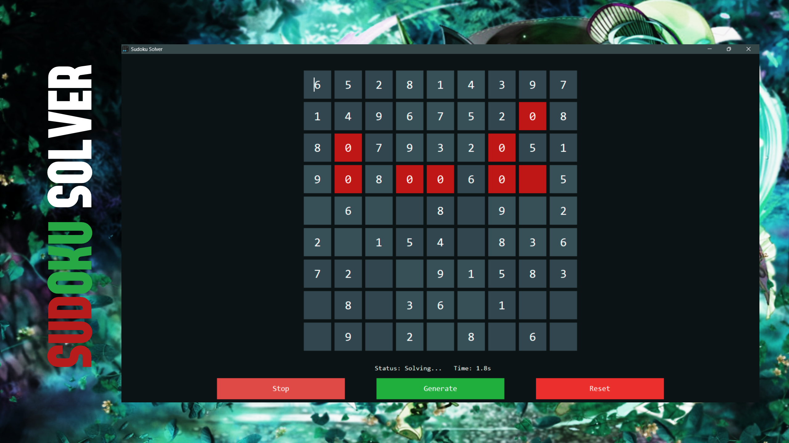
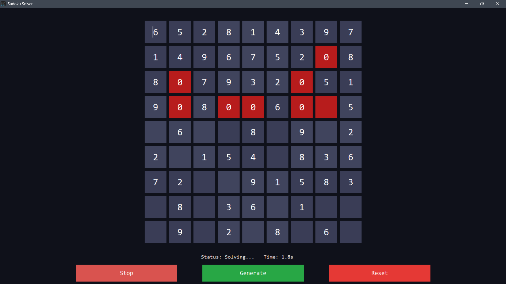

<p align="center">
  
</p>

<h1 align="center">Sudoku Solver
</h1>
<p align="center">
  <strong>A fullscreen desktop Sudoku solver and puzzle generator built with Python and Tkinter.</strong>
</p>

<p align="center">
  
  
  
  
</p>

## Overview

Sudoku Solver is a desktop application for entering, generating, and solving 9x9 Sudoku puzzles. It provides a dark, interface with a centered Sudoku board, keyboard navigation, puzzle generation, reset controls, solver status, and a live solve timer.

The solver uses the classic recursive backtracking algorithm. Empty cells are filled one by one, each candidate number is checked against Sudoku row, column, and 3x3 box rules, and invalid branches are rolled back until a valid solution is found.

## Features

- Fullscreen Tkinter desktop interface.
- Editable 9x9 Sudoku grid.
- Dark theme with alternating 3x3 block colors.
- Manual puzzle entry.
- Random Sudoku puzzle generation.
- Backtracking-based puzzle solver.
- Visual solving feedback with normal/error cell coloring.
- `Decode` button to start solving.
- `Stop` mode to cancel an active solve.
- `Reset` button to clear the board.
- Live status label: idle, solving, stopped, or solved.
- Live timer while solving.
- Arrow-key navigation between cells.
- Input sanitization for invalid values.
- App icon and screenshot/banner assets included.
- No third-party dependencies.

## Screenshot

<p align="center">
  
</p>

## Technology Stack

| Area | Technology |
| --- | --- |
| Language | Python |
| GUI | Tkinter |
| Solver | Recursive backtracking |
| Puzzle Generator | Randomized complete-grid fill with clue removal |
| Timing | `time` module and Tkinter `after` callbacks |
| Runtime File | `main.py` |
| Dependencies | Python standard library only |

## Project Structure

```text
sudoku-solver/
├── README.md
├── LICENSE
├── main.py
├── banner.png
├── icon.ico
└── screenshot.png
```


## Installation

### Prerequisites

- Python 3.10 or newer

Tkinter is included with most standard Python installations. If your Python distribution does not include it, install the Tkinter package for your operating system.

### Run the Application

```bash
cd sudoku-solver
python main.py
```

On some systems, use:

```bash
python3 main.py
```

## Controls

| Action | Input |
| --- | --- |
| Enter numbers | Type `1` to `9` in a selected cell |
| Move selected cell | Arrow keys |
| Solve puzzle | `Decode` button |
| Stop solving | `Stop` button while solver is running |
| Generate puzzle | `Generate` button |
| Clear board | `Reset` button |
| Close app | Window close control |

## How It Works

### Solving

The `PuzzleBrain` class performs the solve process:

1. Sanitizes all cells so invalid entries become `0`.
2. Finds the next empty cell.
3. Tries values from `1` to `9`.
4. Checks whether the value is valid for the row, column, and 3x3 box.
5. Places the value and continues recursively.
6. Backtracks when no valid value can complete the board.

### Puzzle Generation

The generator first creates a complete valid Sudoku grid using randomized backtracking. It then removes 40 cells to create a playable puzzle.

### UI Flow

The `SudokuUI` class owns the board, buttons, timer, status text, keyboard movement, and cell coloring. The solve process runs through a background thread and uses Tkinter callbacks to return status updates to the interface.

### Notes

Sudoku is a constraint-satisfaction problem. Each empty cell is a variable, each digit from `1` to `9` is a possible value, and the constraints require every row, column, and 3x3 subgrid to contain each digit at most once.

Backtracking is a depth-first search strategy. It chooses an empty cell, tries a valid candidate, and recursively continues. If a later contradiction appears, the algorithm returns to the previous decision point and tries another candidate. This approach is simple, deterministic, and effective for standard Sudoku boards.

- The app uses the label `Decode` for the solve action.
- The default generated puzzle removes 40 cells from a completed board.
- The window uses the full screen size reported by the system.
- There is no persistent save/load system yet.

## License

This project is licensed under the MIT License. See [LICENSE](LICENSE) for details.

## Author

Ashish Kumar
